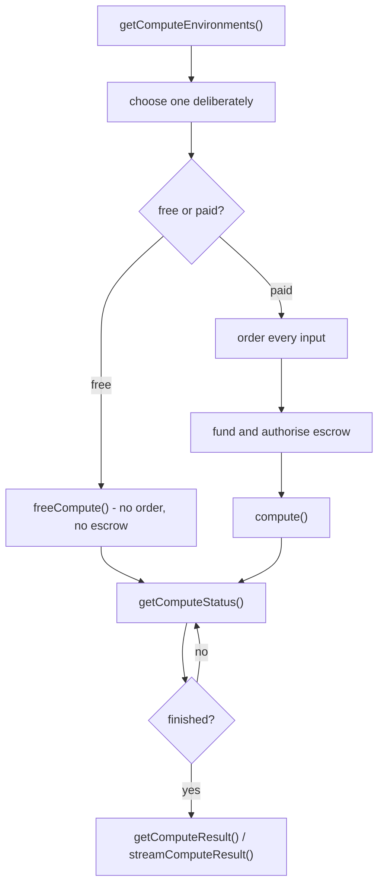

# Compute to Data

Compute to Data runs an algorithm against a dataset without the algorithm's owner ever seeing
the data. You order both, the node runs the job in an isolated environment, and you get back
the results.

## What is different in v2

C2D v2 changed the model substantially:

- **Resources are requested explicitly** — `[{ id: 'cpu', amount: 2 }]` — instead of the old
  fixed CPU/GPU descriptors. Environments advertise what they have and what it costs per chain.
- **Payment runs through an escrow contract.** The node quotes an amount, nautilus locks it.
- **All datasets travel in one array.** v1 had `dataset` plus `additionalDatasets` on the wire.
- **Free compute exists**, with no order, no escrow and no payment token.
- **Output is `{ remoteStorage, encryption }`.** The `publishAlgorithmLog` and `publishOutput`
  flags are gone.



## Pick an environment first

v1 silently used the node's first environment. Worth choosing deliberately: resources,
duration limits, accepted tokens and free-tier availability all differ.

```ts twoslash
import { Nautilus } from '@deltadao/nautilus'
import { Wallet } from 'ethers'
const nautilus = await Nautilus.create(new Wallet('0x1234'))
// ---cut---
const environments = await nautilus.getComputeEnvironments() // [!code focus]

for (const candidate of environments) {
  console.log(candidate.id, candidate.resources, candidate.fees, candidate.free)
}
```

`fees` is keyed by chain id, so a token that is not listed for your chain cannot pay for a
job there.

## A free job

The cheapest way to get started, where the environment offers it.

```ts twoslash
import { Nautilus } from '@deltadao/nautilus'
import { Wallet } from 'ethers'
const nautilus = await Nautilus.create(new Wallet('0x1234'))
// ---cut---
const envs = await nautilus.getComputeEnvironments()
const freeEnv = envs.find((candidate) => candidate.free) // [!code focus]

const free = await nautilus.freeCompute({ // [!code focus]
  dataset: { did: 'did:ope:1234abcd...' }, // [!code focus]
  algorithm: { did: 'did:ope:5678wxyz...' }, // [!code focus]
  computeEnv: freeEnv?.id // [!code focus]
}) // [!code focus]

const freeJobId = free.jobs[0].jobId
```

No datatoken is bought and no escrow is touched. An environment without a `free` section
throws, naming it — free jobs are opt-in for the node operator, and its access list may
restrict who can use them.

:::warning
Free of charge is not the same as ungated — credential policies still apply.
:::

## A paid job

```ts twoslash
import { Nautilus } from '@deltadao/nautilus'
import { Wallet } from 'ethers'
const nautilus = await Nautilus.create(new Wallet('0x1234'))
// ---cut---
const paidEnvs = await nautilus.getComputeEnvironments()
const paidEnv = paidEnvs[0]

const paid = await nautilus.compute({ // [!code focus]
  dataset: { did: 'did:ope:1234abcd...' }, // [!code focus]
  algorithm: { did: 'did:ope:5678wxyz...' }, // [!code focus]
  computeEnv: paidEnv.id, // [!code focus]
  resources: [ // [!code focus]
    { id: 'cpu', amount: 2 }, // [!code focus]
    { id: 'ram', amount: 2 } // [!code focus]
  ], // [!code focus]
  maxJobDuration: 3600 // [!code focus]
}) // [!code focus]

const paidJobId = paid.jobs[0].jobId
console.log('orders', paid.orders)
```

What nautilus does, in order:

1. Resolves every input and picks its compute service.
2. Satisfies **all** credential policies. A failure here aborts with nothing spent — which is
   exactly why it comes before the orders.
3. Asks the node to quote the job: provider fees, reusable orders, and the escrow amount.
4. Funds and authorises escrow for the quoted amount.
5. Orders each input, reusing an existing order where the node says one is valid.
6. Starts the job.

`resources` defaults to each resource's declared minimum, `paymentToken` to the first token
the environment accepts on your chain, and `maxJobDuration` is capped to the environment's
limit with a warning.

:::danger[Paid jobs move real funds]
`compute()` orders every input and locks funds in the `Escrow` contract from what the node
quotes. The payer must differ from the environment's `consumerAddress`, or escrow rejects the
job with "Payer cannot be payee".
:::

## Several datasets

```ts twoslash
import { Nautilus } from '@deltadao/nautilus'
import { Wallet } from 'ethers'
const nautilus = await Nautilus.create(new Wallet('0x1234'))
// ---cut---
const multi = await nautilus.compute({
  dataset: { did: 'did:ope:1234abcd...' },
  additionalDatasets: [ // [!code focus]
    { did: 'did:ope:926098d069b017dcf...' }, // [!code focus]
    { did: 'did:ope:475698d069b017dcf...' } // [!code focus]
  ], // [!code focus]
  algorithm: { did: 'did:ope:5678wxyz...' }
})
```

nautilus assembles the single array the node expects. Every dataset is ordered.

## Following the job

```ts twoslash
import { Nautilus } from '@deltadao/nautilus'
import { Wallet } from 'ethers'
const nautilus = await Nautilus.create(new Wallet('0x1234'))
const jobId = 'a-job-id'
// ---cut---
const job = await nautilus.getComputeStatus({ jobId }) // [!code focus]

console.log(job?.status, job?.statusText)
```

Status `70` (`JobFinished`) means the algorithm has run; `71` (`JobSettle`) means it has
run and the node is only waiting on the payment-claim cron. Results are readable at
either. While the job runs, you can read the container's logs — useful for debugging an
algorithm you cannot otherwise observe:

```ts twoslash
import { Nautilus } from '@deltadao/nautilus'
import { Wallet } from 'ethers'
const nautilus = await Nautilus.create(new Wallet('0x1234'))
const jobId = 'a-job-id'
// ---cut---
const logs = await nautilus.getComputeLogs({ jobId }) // [!code focus]
```

## Getting the results

```ts twoslash
import { Nautilus } from '@deltadao/nautilus'
import { Wallet } from 'ethers'
const nautilus = await Nautilus.create(new Wallet('0x1234'))
const jobId = 'a-job-id'
// ---cut---
const resultUrl = await nautilus.getComputeResult({ jobId }) // [!code focus]

if (resultUrl) {
  const results = await fetch(resultUrl)
}
```

`undefined` means the job has not finished, the node does not know it, or it produced no
`output` result — the log line says which. A job also produces `algorithmLog`,
`configrationLog` and `publishLog` entries, reachable by `resultIndex`.

For a large result, stream it instead of buffering a download:

```ts twoslash
import { Nautilus } from '@deltadao/nautilus'
import { Wallet } from 'ethers'
const nautilus = await Nautilus.create(new Wallet('0x1234'))
const jobId = 'a-job-id'
// ---cut---
const stream = await nautilus.streamComputeResult({ jobId }) // [!code focus]

for await (const chunk of stream) { // [!code focus]
  process.stdout.write(chunk) // [!code focus]
} // [!code focus]
```

:::info
`getComputeResult` returns `undefined` until the job reaches a finished state, rather than
throwing — poll [`getComputeStatus`](/docs/api/nautilus/getComputeStatus) first, or use
[`waitForComputeJob`-style polling](/docs/api/nautilus/getComputeStatus) in your own loop.
:::

## Stopping a job

```ts twoslash
import { Nautilus } from '@deltadao/nautilus'
import { Wallet } from 'ethers'
const nautilus = await Nautilus.create(new Wallet('0x1234'))
const jobId = 'a-job-id'
// ---cut---
await nautilus.stopCompute({ jobId }) // [!code focus]
```

## Publishing for compute

On the dataset side, a `COMPUTE` service decides which algorithms may run. Pinning specific
algorithms is the safe default — nautilus resolves their container and file checksums at
publish time, so a publisher cannot swap the container afterwards:

```ts twoslash
import { FileTypes, ServiceBuilder, ServiceTypes } from '@deltadao/nautilus'
// ---cut---
const computeService = new ServiceBuilder<ServiceTypes.COMPUTE, FileTypes.URL>({
  serviceType: ServiceTypes.COMPUTE
})
  .setServiceEndpoint('https://ocean-node.dev.pontus-x.eu')
  .addFile({ type: 'url', url: 'https://data.example/x.csv', method: 'GET' })
  .setPricing({ type: 'free' })
  .allowRawAlgorithms(false) // no unpublished code // [!code focus]
  .allowAlgorithmNetworkAccess(false) // no exfiltration // [!code focus]
  .addTrustedAlgorithms([{ did: 'did:ope:926098d069b017dcf...' }]) // [!code focus]
  .build()
```

`allowAlgorithmNetworkAccess(false)` is what makes the isolation meaningful: without network
access, an algorithm cannot send your data anywhere.

See [Publishing](/docs/guides/publish) for the algorithm side.

## Try it

The [examples](/docs/examples) cover the whole job lifecycle:

```sh
npm start -- compute:envs                            # what a node offers, and at what price
npm start -- compute:free  <datasetDid> <algoDid>    # no order, no escrow
npm start -- compute:paid  <datasetDid> <algoDid>    # funds the escrow from the node's quote
npm start -- compute:full  <datasetDid> <algoDid>    # start → wait → logs → result
```
