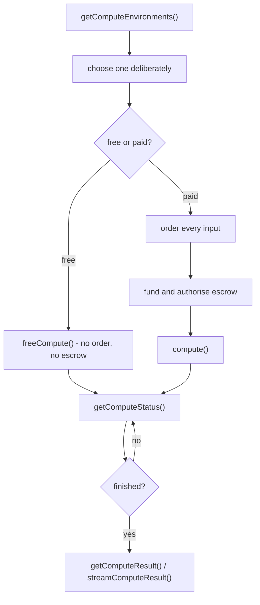

# Compute to Data

Compute to Data runs an algorithm against a dataset without the algorithm's owner ever seeing
the data. You order both, the node runs the job in an isolated environment, and you get back
the results.

## What is different in v2

C2D v2 changed the model substantially:

- **Resources are requested explicitly** — `[{ id: 'cpu', amount: 2 }]` — instead of the old
  fixed CPU/GPU descriptors. Environments advertise what they have and what it costs per chain.
- **Payment runs through an escrow contract.** The node quotes an amount, nautilus locks it.
- **All datasets travel in one array.** v1 had `dataset` plus `additionalDatasets` on the wire.
- **Free compute exists**, with no order, no escrow and no payment token.
- **Output is `{ remoteStorage, encryption }`.** The `publishAlgorithmLog` and `publishOutput`
  flags are gone.


```mermaid
flowchart TD
  A["getComputeEnvironments()"] --> B["choose one deliberately"]
  B --> C{"free or paid?"}
  C -->|free| D["freeCompute() - no order, no escrow"]
  C -->|paid| E["order every input"]
  E --> F["fund and authorise escrow"]
  F --> G["compute()"]
  D --> H["getComputeStatus()"]
  G --> H
  H --> I{"finished?"}
  I -->|no| H
  I -->|yes| J["getComputeResult() / streamComputeResult()"]
```

## Pick an environment first

v1 silently used the node's first environment. Worth choosing deliberately: resources,
duration limits, accepted tokens and free-tier availability all differ.

```ts twoslash
import { Nautilus } from '@deltadao/nautilus'
import { Wallet } from 'ethers'
const nautilus = await Nautilus.create(new Wallet('0x1234'))
// ---cut---
const environments = await nautilus.getComputeEnvironments() // [!code focus]

for (const candidate of environments) {
  console.log(candidate.id, candidate.resources, candidate.fees, candidate.free)
}
```

`fees` is keyed by chain id, so a token that is not listed for your chain cannot pay for a
job there.

## A free job

The cheapest way to get started, where the environment offers it.

```ts twoslash
import { Nautilus } from '@deltadao/nautilus'
import { Wallet } from 'ethers'
const nautilus = await Nautilus.create(new Wallet('0x1234'))
// ---cut---
const envs = await nautilus.getComputeEnvironments()
const freeEnv = envs.find((candidate) => candidate.free) // [!code focus]

const free = await nautilus.freeCompute({ // [!code focus]
  dataset: { did: 'did:ope:1234abcd...' }, // [!code focus]
  algorithm: { did: 'did:ope:5678wxyz...' }, // [!code focus]
  computeEnv: freeEnv?.id // [!code focus]
}) // [!code focus]

const freeJobId = free.jobs[0].jobId
```

The `jobId` is `<environmentHash>-<jobId>`, the form the node gives a started job. Keep it
whole: every job method takes it, and a bare id is refused.

No datatoken is bought and no escrow is touched. An environment without a `free` section
throws, naming it — free jobs are opt-in for the node operator, and its access list may
restrict who can use them.

:::warning
Free of charge is not the same as ungated — credential policies still apply.
:::

## A paid job

```ts twoslash
import { Nautilus } from '@deltadao/nautilus'
import { parseUnits, Wallet } from 'ethers'
const nautilus = await Nautilus.create(new Wallet('0x1234'))
// ---cut---
const paidEnvs = await nautilus.getComputeEnvironments()
const paidEnv = paidEnvs[0]
const chainId = nautilus.getOceanConfig().chainId
const paymentToken = paidEnv.fees[String(chainId)][0].feeToken

const paid = await nautilus.compute({ // [!code focus]
  dataset: { did: 'did:ope:1234abcd...' }, // [!code focus]
  algorithm: { did: 'did:ope:5678wxyz...' }, // [!code focus]
  computeEnv: paidEnv.id, // [!code focus]
  resources: [ // [!code focus]
    { id: 'cpu', amount: 2 }, // [!code focus]
    { id: 'ram', amount: 2 } // [!code focus]
  ], // [!code focus]
  maxJobDuration: 3600, // [!code focus]
  paymentToken, // [!code focus]
  // the most this job may lock in escrow, in the token's smallest unit // [!code focus]
  maxEscrowPayment: { token: paymentToken, amount: parseUnits('5', 18) } // [!code focus]
}) // [!code focus]

const paidJobId = paid.jobs[0].jobId
console.log('orders', paid.orders)
```

What nautilus does, in order:

1. Resolves every input and picks its compute service.
2. Satisfies **all** credential policies. A failure here aborts with nothing spent — which is
   exactly why it comes before the orders.
3. Asks the node to quote the job: provider fees, reusable orders, and the escrow amount.
4. Checks the quote against what you allowed, before any transaction: the provider fees
   against `maxProviderFee` / `confirmProviderFees`, the escrow contract against the pinned
   one (the chain's `EnterpriseEscrow` by default), and the escrow amount against
   `maxEscrowPayment` / `confirmEscrowPayment`. A zero escrow payment funds nothing and is
   not checked further. Then it plans every input's order, reading its pricing from chain,
   so an input that cannot be ordered is refused before escrow is funded.
5. Funds and authorises escrow for exactly the quoted amount: it approves and deposits only
   what escrow lacks, and authorises the environment to lock the job's amount.
6. Orders each input as planned, reusing an existing order where the node says one is valid.
7. Starts the job.

Steps 5 to 7 run one job at a time per chain, payer, payment token and environment within
one `Nautilus` instance, so two jobs started together do not overwrite each other's escrow
authorisation. Jobs from another instance or process are not serialised; see
[Concurrent jobs](/docs/api/nautilus/compute#concurrent-jobs).

A `resources` list is sent exactly as given, and the node gives each resource it leaves out
that resource's minimum, often `0`; a job with `0` RAM runs without a memory limit. Without
`resources`, nautilus requests every resource the environment lists at its minimum, raised to
`1` for `cpu`, `ram` and `disk` within the resource's maximum; other resources, such as GPUs,
at their minimum. `paymentToken` defaults to the first token the
environment accepts on your chain, and `maxJobDuration` is capped to the environment's limit
with a warning.

:::danger[Paid jobs move real funds]
`compute()` orders every input and locks funds in the escrow contract from what the node
quotes. The node chooses that amount and the inputs' provider fees, so set
`maxEscrowPayment` and `maxProviderFee` (here or once in
[`Nautilus.create`](/docs/api/nautilus/create#maxproviderfee)) to the most you are prepared
to pay. Without them, or a confirmation callback, a paid job is refused before anything is
spent. Setting either option of a pair here (`maxProviderFee` / `confirmProviderFees`, or
`maxEscrowPayment` / `confirmEscrowPayment`) replaces both `Nautilus.create` defaults of
that pair for the call. Escrow is only ever funded in one contract: the chain's **`EnterpriseEscrow`** in
Ocean's address data (ocean.js's bundled addresses, or `ADDRESS_FILE`), the contract
ocean-node 4.2.0 uses where the chain has one; else the chain's `Escrow`. Passing
`config: { escrow: '0x…' }` to `Nautilus.create` pins that contract instead, and only that
one. On a chain with neither (Pontus-X devnet), set the chain's EnterpriseEscrow contract
as `config.escrow`, or paid jobs are refused. See
[Escrow contract](/docs/api/nautilus/compute#escrow-contract).

The payer must differ from the environment's `consumerAddress`, or escrow rejects the
job with "Payer cannot be payee".
:::

## Several datasets

```ts twoslash
import { Nautilus } from '@deltadao/nautilus'
import { Wallet } from 'ethers'
const nautilus = await Nautilus.create(new Wallet('0x1234'))
// ---cut---
const multi = await nautilus.compute({
  dataset: { did: 'did:ope:1234abcd...' },
  additionalDatasets: [ // [!code focus]
    { did: 'did:ope:926098d069b017dcf...' }, // [!code focus]
    { did: 'did:ope:475698d069b017dcf...' } // [!code focus]
  ], // [!code focus]
  algorithm: { did: 'did:ope:5678wxyz...' }
})
```

nautilus assembles the single array the node expects. Every dataset is ordered.

## Following the job

```ts twoslash
import { Nautilus } from '@deltadao/nautilus'
import { Wallet } from 'ethers'
const nautilus = await Nautilus.create(new Wallet('0x1234'))
const jobId = 'a-job-id'
// ---cut---
const job = await nautilus.getComputeStatus({ jobId }) // [!code focus]

console.log(job?.status, job?.statusText)
```

`undefined` means the node does not know the job. The job has finished once the node sets
its `dateFinished`, whether it succeeded or not, and the status says how it ended: failed
jobs end below `70`, for example `41` when the algorithm failed or `11` when its image could
not be pulled. Poll on `dateFinished` rather than on a status. A finished job's results are
readable; at `71` (`JobSettle`) the node may still be writing `outputs.tar`, which is listed
as the `output` result once it is written.

The algorithm's logs are useful for debugging an algorithm you cannot otherwise observe.
While the job runs they stream live; once it has finished, `getComputeLogs` reads the job's
`algorithmLog` result instead, because the node serves live logs only while the algorithm
runs:

```ts twoslash
import { Nautilus } from '@deltadao/nautilus'
import { Wallet } from 'ethers'
const nautilus = await Nautilus.create(new Wallet('0x1234'))
const jobId = 'a-job-id'
// ---cut---
const logs = await nautilus.getComputeLogs({ jobId }) // [!code focus]

for await (const chunk of logs) process.stdout.write(chunk) // [!code focus]
```

:::warning[Treat the job id as a secret]
On ocean-node 4.2.2 the live-log endpoint checks that the request is signed, but not that
the signer owns the job, so anyone who has the qualified job id can stream a running job's
logs. Keep the id where you would keep other access details, and out of shared logs.
:::

## Getting the results

```ts twoslash
import { Nautilus } from '@deltadao/nautilus'
import { Wallet } from 'ethers'
const nautilus = await Nautilus.create(new Wallet('0x1234'))
const jobId = 'a-job-id'
// ---cut---
const resultUrl = await nautilus.getComputeResult({ jobId }) // [!code focus]

if (resultUrl) {
  const results = await fetch(resultUrl)
}
```

`undefined` means the job has not finished or not listed its `output` yet, the node does not
know it, or it produced no `output` result (a failed job usually has none) — the log line
says which.

The `output` result is `outputs.tar`, a **tar archive** of everything the algorithm wrote to
its outputs folder, so unpack it rather than reading it as a file of its own. It is listed
only when the results stay on the node; with `output` storage or an `outputBucketId` they go
there instead. A finished job's `results` (on [`getComputeStatus`](/docs/api/nautilus/getComputeStatus))
list on ocean-node 4.2:

| `type` | File |
| --- | --- |
| `imageLog` | `image.log`, pulling or building the algorithm's image |
| `configurationLog` | `configuration.log`, preparing the job's inputs and algorithm |
| `algorithmLog` | `algorithm.log`, what the algorithm printed |
| `output` | `outputs.tar`, the algorithm's outputs |

Pass a result's `index` as `resultIndex` to read another one.

For a large result, stream it instead of buffering a download:

```ts twoslash
import { Nautilus } from '@deltadao/nautilus'
import { Wallet } from 'ethers'
const nautilus = await Nautilus.create(new Wallet('0x1234'))
const jobId = 'a-job-id'
// ---cut---
const stream = await nautilus.streamComputeResult({ jobId }) // [!code focus]

for await (const chunk of stream) { // [!code focus]
  process.stdout.write(chunk) // [!code focus]
} // [!code focus]
```

It reads the same result as `getComputeResult`: the `output` unless `resultIndex` says
otherwise. Where `getComputeResult` returns `undefined`, it throws.

:::info
`getComputeResult` returns `undefined` until the job has finished (its `dateFinished` is
set) and listed its `output`, rather than throwing — poll [`getComputeStatus`](/docs/api/nautilus/getComputeStatus) first, or use
[`waitForComputeJob`-style polling](/docs/api/nautilus/getComputeStatus) in your own loop.
:::

## Stopping a job

```ts twoslash
import { Nautilus } from '@deltadao/nautilus'
import { Wallet } from 'ethers'
const nautilus = await Nautilus.create(new Wallet('0x1234'))
const jobId = 'a-job-id'
// ---cut---
await nautilus.stopCompute({ jobId }) // [!code focus]
```

## Publishing for compute

On the dataset side, a `COMPUTE` service decides which algorithms may run. Pinning specific
algorithms is the safe default — nautilus resolves their container and file checksums at
publish time, so a publisher cannot swap the container afterwards:

```ts twoslash
import { FileTypes, ServiceBuilder, ServiceTypes } from '@deltadao/nautilus'
// ---cut---
const computeService = new ServiceBuilder<ServiceTypes.COMPUTE, FileTypes.URL>({
  serviceType: ServiceTypes.COMPUTE
})
  .setServiceEndpoint('https://ocean-node.dev.pontus-x.eu')
  .addFile({ type: 'url', url: 'https://data.example/x.csv', method: 'GET' })
  .setPricing({ type: 'free' })
  .allowRawAlgorithms(false) // no unpublished code // [!code focus]
  .allowAlgorithmNetworkAccess(false) // no exfiltration // [!code focus]
  .addTrustedAlgorithms([{ did: 'did:ope:926098d069b017dcf...' }]) // [!code focus]
  .build()
```

`allowAlgorithmNetworkAccess(false)` is what makes the isolation meaningful: without network
access, an algorithm cannot send your data anywhere.

These settings belong to the dataset. ocean-node reads them from the dataset's service only,
so nautilus publishes the services of an `algorithm` asset without them.

See [Publishing](/docs/guides/publish) for the algorithm side.

## Try it

The [examples](/docs/examples) cover the whole job lifecycle:

```sh
npm start -- compute:envs                            # what a node offers, and at what price
npm start -- compute:free  <datasetDid> <algoDid>    # no order, no escrow
npm start -- compute:paid  <datasetDid> <algoDid>    # funds the escrow from the node's quote
npm start -- compute:full  <datasetDid> <algoDid>    # start → wait → logs → result
```
