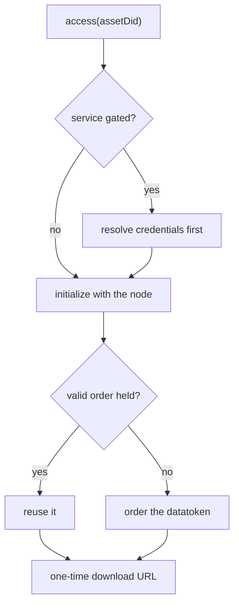

# Download

Downloading an asset means ordering one of its services and then fetching the data through a
one-time URL.

## The short version

```ts twoslash
import { JsonRpcProvider, Wallet } from 'ethers'
import { Nautilus } from '@deltadao/nautilus'

const signer = new Wallet('0x...', new JsonRpcProvider('https://rpc.dev.pontus-x.eu'))
const nautilus = await Nautilus.create(signer, {
  config: { oceanNodeUri: 'https://ocean-node.dev.pontus-x.eu' }
})
// ---cut---
const { url } = await nautilus.access({ assetDid: 'did:ope:1234abcd...' }) // [!code focus]

const response = await fetch(url)
const data = await response.text()
```

One call covers everything: satisfying any credential policy, asking the node for provider
fees, reusing or placing an order, and building the URL.



Credentials are resolved before anything is ordered, so a policy you cannot satisfy costs
nothing.

## What you get back

```ts twoslash
import { Nautilus } from '@deltadao/nautilus'
import { Wallet } from 'ethers'
const nautilus = await Nautilus.create(new Wallet('0x1234'))
// ---cut---
const { url, transferTxId, reusedOrder, serviceId } = await nautilus.access({
  assetDid: 'did:ope:1234abcd...'
})
```

`reusedOrder` is worth checking: `true` means no datatoken was bought, because an order from
a previous access was still inside the service's timeout. That is the difference between a
free download and a paid one.

:::warning
v1 returned a bare URL string here. The object form exists so the order backing the download
is visible to the caller.
:::

## Choosing a service

An asset can offer several services. By default nautilus takes the first `access` service;
name one explicitly when there is more than one:

```ts twoslash
import { Nautilus, getServices } from '@deltadao/nautilus'
import { Wallet } from 'ethers'
const nautilus = await Nautilus.create(new Wallet('0x1234'))
// ---cut---
const asset = await nautilus.getAsset('did:ope:1234abcd...')

const services = getServices(asset) // [!code focus]

const { url } = await nautilus.access({
  assetDid: asset.id,
  serviceId: services[0].id // [!code focus]
})
```

Read the asset through the exported helpers — `getServices`, `getMetadata` and friends —
rather than indexing into `credentialSubject`. They go through a version-aware manager, so
your code survives a future DDO version moving fields.

## Consumer parameters

If a service declares consumer parameters, pass values through `userdata`:

```ts twoslash
import { Nautilus } from '@deltadao/nautilus'
import { Wallet } from 'ethers'
const nautilus = await Nautilus.create(new Wallet('0x1234'))
// ---cut---
const { url } = await nautilus.access({
  assetDid: 'did:ope:1234abcd...',
  userdata: { // [!code focus]
    region: 'eu', // [!code focus]
    limit: 1000 // [!code focus]
  } // [!code focus]
})
```

See the [ConsumerParameterBuilder](/docs/api/ConsumerParameterBuilder) for the publishing
side.

## Selecting a file

A service can serve several files. `fileIndex` defaults to `0`:

```ts twoslash
import { Nautilus } from '@deltadao/nautilus'
import { Wallet } from 'ethers'
const nautilus = await Nautilus.create(new Wallet('0x1234'))
// ---cut---
const { url } = await nautilus.access({
  assetDid: 'did:ope:1234abcd...',
  fileIndex: 1 // [!code focus]
})
```

## Credential-gated assets

If the service requires a verifiable credential, configure a credential provider on the
instance and nothing changes here — nautilus resolves the policy **before** ordering, so a
policy you cannot satisfy costs nothing. See
[Credential-gated assets](/docs/guides/identity).

## What it costs

Pricing is read from chain rather than from a subgraph, which v1 depended on and the current
stack no longer runs. To inspect a price before committing:

```ts twoslash
import {
  Nautilus,
  getDatatokenForService,
  getOrderPrice,
  getPricingInfo,
  getServices
} from '@deltadao/nautilus'
import { Wallet } from 'ethers'
const nautilus = await Nautilus.create(new Wallet('0x1234'))
// ---cut---
const asset = await nautilus.getAsset('did:ope:1234abcd...')
const serviceId = getServices(asset)[0].id
const datatoken = getDatatokenForService(asset, serviceId) as string

const pricing = await getPricingInfo( // [!code focus]
  nautilus.getSigner(), // [!code focus]
  datatoken, // [!code focus]
  nautilus.getOceanConfig() // [!code focus]
) // [!code focus]

const price = await getOrderPrice(
  nautilus.getSigner(),
  pricing,
  nautilus.getOceanConfig()
)

console.log(pricing.schema, price.total)
```

`pricing.schema` is `'fixed'`, `'free'`, or `'none'` when the datatoken has neither a
fixed-rate exchange nor a dispenser and so cannot be ordered at all.

## Try it

Runnable versions of everything on this page live in [`examples/`](/docs/examples):

```sh
npm start -- access:price did:ope:…      # what it costs, before you buy
npm start -- access:download did:ope:…   # order and fetch
npm start -- access:service did:ope:…    # pick a specific service
npm start -- access:userdata did:ope:…   # pass consumer parameters
```
