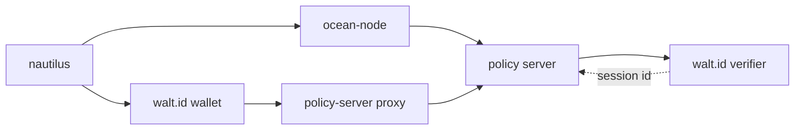
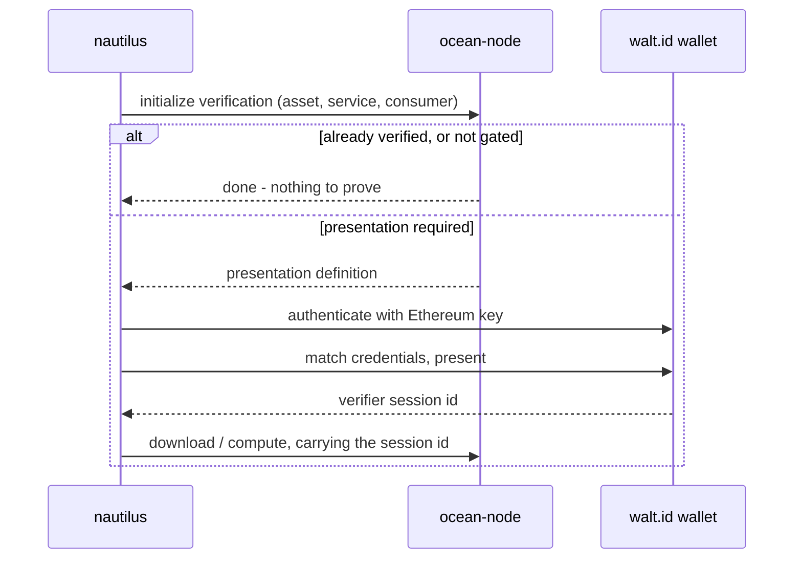

# Credential-gated assets

Some assets require you to prove something about yourself before you can access them — that
you hold a particular verifiable credential, issued by someone the publisher trusts. This
guide covers both sides: consuming a gated asset, and publishing one.

This is new in nautilus v2. It did not exist in v1, because the stack it depends on did not.

## How the pieces fit

Four components are involved, and they form a deliberate loop so that the node observes
every credential exchange:



The loop is deliberate: every credential exchange passes through the node, so it observes the
result rather than taking the client's word for it.

nautilus only ever talks to two of them directly: **ocean-node**, through its
policy-server passthrough endpoint, and the **walt.id wallet**, to actually present
credentials. Everything else happens between the services.

What nautilus needs out of the exchange is one thing: a **verifier session id**. That is the
only value ocean-node wants when you later download or run compute.

## Consuming a gated asset

Configure a credential provider once. Nothing changes at the call site — `access` and
`compute` handle the exchange themselves.

```ts twoslash
import { JsonRpcProvider, Wallet } from 'ethers'
import { Nautilus, WaltIdCredentialProvider } from '@deltadao/nautilus'

const signer = new Wallet('0x...', new JsonRpcProvider('https://rpc.dev.pontus-x.eu'))
const config = { oceanNodeUri: 'https://node.example.org' }

// The provider needs a node client, so build the instance in two steps.
const bootstrap = await Nautilus.create(signer, { config })

const nautilus = await Nautilus.create(signer, {
  config,
  credentials: new WaltIdCredentialProvider(bootstrap.getNodeClient(), { // [!code focus]
    walletApi: 'https://wallet.example.org' // [!code focus]
  }) // [!code focus]
})

// Unchanged — the credential exchange happens inside.
const { url } = await nautilus.access({ assetDid: 'did:ope:1234abcd...' })
```

### What happens, in order



1. nautilus asks the node to start a verification for this asset, service and consumer.
2. If the node says verification already succeeded — or the asset carries no credential
   policy at all — it stops there.
3. Otherwise it fetches the presentation definition, authenticates to your walt.id wallet
   with your Ethereum key, finds credentials matching the definition, and presents them.
4. The resulting session id is carried into the download or compute call.

:::info
Credentials are always resolved **before** anything is ordered. A policy you cannot satisfy
costs you nothing.
:::

### Choosing credentials and DIDs

By default the provider is **headless**: it presents every matching credential and uses the
wallet's first DID. That is what makes it usable from a script or CI with no interaction.

For an interactive application, supply the selection callbacks instead:

```ts twoslash
import { JsonRpcProvider, Wallet } from 'ethers'
import { Nautilus, WaltIdCredentialProvider } from '@deltadao/nautilus'
const signer = new Wallet('0x1234', new JsonRpcProvider('https://rpc.dev.pontus-x.eu'))
const config = { oceanNodeUri: 'https://node.example.org' }
const bootstrap = await Nautilus.create(signer, { config })
// ---cut---
const credentials = new WaltIdCredentialProvider(bootstrap.getNodeClient(), {
  walletApi: 'https://wallet.example.org',

  // Ask the user which of the matching credentials to present.
  onSelectCredentials: async (matches) => { // [!code focus]
    return matches.filter((candidate) => candidate.id === 'a-chosen-credential') // [!code focus]
  }, // [!code focus]

  // Ask the user which holder DID to present as.
  onSelectDid: async (dids) => dids[0].did // [!code focus]
})
```

You can also pin a wallet and DID outright with `walletId` and `did`.

### Diagnosing a refusal

When a presentation is rejected, the reason is usually a specific policy — not a general
"access denied". `explainFailure` digs it out of the verifier's report:

```ts twoslash
import { JsonRpcProvider, Wallet } from 'ethers'
import { Nautilus, WaltIdCredentialProvider } from '@deltadao/nautilus'
const signer = new Wallet('0x1234', new JsonRpcProvider('https://rpc.dev.pontus-x.eu'))
const config = { oceanNodeUri: 'https://node.example.org' }
const bootstrap = await Nautilus.create(signer, { config })
const credentials = new WaltIdCredentialProvider(bootstrap.getNodeClient(), {
  walletApi: 'https://wallet.example.org'
})
// ---cut---
const reason = await credentials.explainFailure('a-session-id') // [!code focus]
// @log: 'revoked-status-list: credential is revoked'
```

If the wallet holds nothing that matches, the thrown error carries the credentials you are
*missing*, rather than just reporting no match.

### Reusing a session you already hold

If a session was established elsewhere — in a browser, say — replay it instead of repeating
the exchange:

```ts twoslash
import { StaticCredentialProvider } from '@deltadao/nautilus'
// ---cut---
const credentials = new StaticCredentialProvider('an-existing-session-id') // [!code focus]
```

:::warning
Never invent a session id. The policy server derives it from
`sha256(consumerAddress:documentId:serviceId)` plus a random half, and rejects any session
whose context does not match the request. A session is valid for exactly one
(asset, service, consumer) triple — which is also why nautilus keys its session cache on all
three.
:::

## Publishing a gated asset

Declare which credentials you require, and the checks they must pass:

```ts twoslash
import { AssetBuilder, CredentialListTypes } from '@deltadao/nautilus'

const assetBuilder = new AssetBuilder()
// ---cut---
assetBuilder
  .addRequestCredentials(CredentialListTypes.ALLOW, [ // [!code focus]
    { type: 'VerifiableId', format: 'jwt_vc_json' } // [!code focus]
  ]) // [!code focus]
  .setVcPolicies(CredentialListTypes.ALLOW, [ // [!code focus]
    'signature', // [!code focus]
    'not-before', // [!code focus]
    'revoked-status-list' // [!code focus]
  ]) // [!code focus]
  .setVpPolicies(CredentialListTypes.ALLOW, [ // [!code focus]
    'holder-binding', // [!code focus]
    { policy: 'minimum-credentials', args: '1' } // [!code focus]
  ]) // [!code focus]
```

**VC policies** check each presented credential; **VP policies** check the presentation as a
whole. The policy server's defaults are `signature`, `not-before` and
`revoked-status-list`. Valid names can be listed from the verifier's
`/openid4vc/policy-list` endpoint.

Gating also works per service, via
[`ServiceBuilder.addRequestCredentials`](/docs/api/servicebuilder/addRequestCredentials) —
useful when an asset offers both an open preview and a restricted full dataset.

### Issuing from a real DID

By default nautilus signs the DDO with your Ethereum key, using a non-standard
`alg: 'ETH-EIP191'` header, and sets the issuer to your address. That works without any SSI
setup, but the credential is not verifiable by a standard JOSE verifier.

To issue from a proper DID, sign with a walt.id wallet key:

```ts twoslash
import { JsonRpcProvider, Wallet } from 'ethers'
import {
  Nautilus,
  NodePersistentRemoteStore,
  WaltIdHttpWallet,
  WaltIdVcSigner
} from '@deltadao/nautilus'

const signer = new Wallet('0x...', new JsonRpcProvider('https://rpc.dev.pontus-x.eu'))
const config = { oceanNodeUri: 'https://node.example.org' }
const bootstrap = await Nautilus.create(signer, { config })

const wallet = new WaltIdHttpWallet({ apiUrl: 'https://wallet.example.org' })
const session = await wallet.authenticate(signer)
const [walletRef] = await wallet.listWallets(session.token)
const [key] = await wallet.listKeys(walletRef.id, session.token)
const [did] = await wallet.listDids(walletRef.id, session.token)

const nautilus = await Nautilus.create(signer, {
  config,
  remoteStore: new NodePersistentRemoteStore(bootstrap.getNodeClient()),
  ddoSigner: new WaltIdVcSigner({ // [!code focus]
    wallet, // [!code focus]
    walletId: walletRef.id, // [!code focus]
    keyId: key.keyId.id, // [!code focus]
    did: did.did, // [!code focus]
    token: session.token // [!code focus]
  }) // [!code focus]
})
```

## Two things to know about deployments

**A node without a policy server allows everything.** ocean-node fails open when its
`POLICY_SERVER_URL` is unset. nautilus detects this — `initializePSVerification` returns
`null` — and continues without SSI rather than failing. Do not assume a gated asset is
enforced without checking how the node is configured.

**Publish-time enforcement does not exist yet.** The policy server's `newDDO`, `updateDDO`,
`validateDDO`, `encrypt` and `decrypt` actions are stubs that always allow. Only
`download` and `startCompute` are really checked.

## Swapping out walt.id

The walt.id endpoints nautilus uses (`/wallet-api/*`, `/openid4vc/*`) are the **v1**
generation, which walt.id has marked for deprecation in favour of `*-api2`
(OID4VCI/VP 1.0).

nautilus keeps them behind a narrow eleven-method `WaltIdWallet` interface for exactly this
reason: a v2 backend is a new implementation of that interface, not a rewrite. Pass your own
with the `wallet` option.
