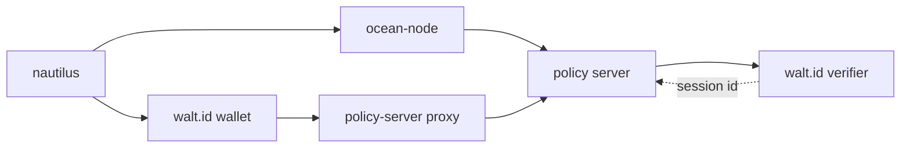
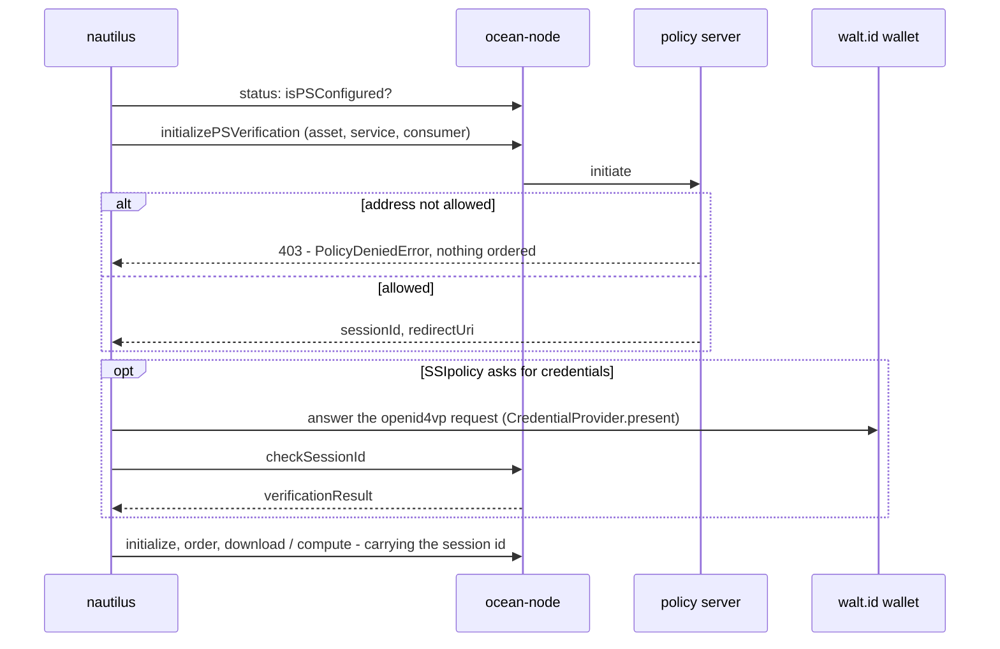

# Credential-gated assets

Some assets require you to prove something about yourself before you can access them — that
you hold a particular verifiable credential, issued by someone the publisher trusts. This
guide covers both sides: consuming a gated asset, and publishing one.

This is new in nautilus v2. It did not exist in v1, because the stack it depends on did not.

## How the pieces fit

Four components are involved, and they form a deliberate loop so that the node observes
every credential exchange:


```mermaid
flowchart LR
  N[nautilus] --> ON[ocean-node]
  ON --> PS[policy server]
  PS --> V[walt.id verifier]
  N --> W[walt.id wallet]
  W --> PX[policy-server proxy]
  PX --> PS
  V -.->|session id| PS
```

The loop is deliberate: every credential exchange passes through the node, so it observes the
result rather than taking the client's word for it.

nautilus only ever talks to two of them directly: **ocean-node**, through its
`initializePSVerification` and policy-server passthrough endpoints, and the **walt.id
wallet**, to actually present credentials. Everything else happens between the services.

What nautilus needs out of the exchange is one thing: a **policy-server session id**. On a
node with a policy server, ocean-node checks it on every download and compute job of an asset
that has `credentials`, whether the asset is gated by addresses or by an `SSIpolicy`.

## Consuming a gated asset

nautilus opens the policy-server session itself, inside `access`, `compute` and
`freeCompute`. Nothing changes at the call site.

**Gated by addresses only**, an asset needs no wallet and no configuration: the session the
policy server opens is all the node checks.

```ts twoslash
import { JsonRpcProvider, Wallet } from 'ethers'
import { Nautilus } from '@deltadao/nautilus'

const signer = new Wallet('0x...', new JsonRpcProvider('https://rpc.dev.pontus-x.eu'))
const config = { oceanNodeUri: 'https://node.example.org' }
// ---cut---
const nautilus = await Nautilus.create(signer, { config })

// The session is opened before the order, and carried into the download URL.
const { url } = await nautilus.access({ assetDid: 'did:ope:1234abcd...' })
```

**Gated by an `SSIpolicy`**, an asset asks for a verifiable presentation. Configure a
credential provider once; it answers the presentation request from your wallet.

```ts twoslash
import { JsonRpcProvider, Wallet } from 'ethers'
import { Nautilus, WaltIdCredentialProvider } from '@deltadao/nautilus'

const signer = new Wallet('0x...', new JsonRpcProvider('https://rpc.dev.pontus-x.eu'))
const config = { oceanNodeUri: 'https://node.example.org' }

// The provider needs a node client, so build the instance in two steps.
const bootstrap = await Nautilus.create(signer, { config })

const nautilus = await Nautilus.create(signer, {
  config,
  credentials: new WaltIdCredentialProvider(bootstrap.getNodeClient(), { // [!code focus]
    walletApi: 'https://wallet.example.org' // [!code focus]
  }) // [!code focus]
})

// Unchanged — the credential exchange happens inside.
const { url } = await nautilus.access({ assetDid: 'did:ope:1234abcd...' })
```

Without a provider, an asset that asks for a presentation is refused with a clear error
before anything is signed or ordered.

### What happens, in order


```mermaid
sequenceDiagram
    participant N as nautilus
    participant ON as ocean-node
    participant PS as policy server
    participant W as walt.id wallet
    N->>ON: status: isPSConfigured?
    N->>ON: initializePSVerification (asset, service, consumer)
    ON->>PS: initiate
    alt address not allowed
        PS-->>N: 403 - PolicyDeniedError, nothing ordered
    else allowed
        PS-->>N: sessionId, redirectUri
    end
    opt SSIpolicy asks for credentials
        N->>W: answer the openid4vp request (CredentialProvider.present)
        N->>ON: checkSessionId
        ON-->>N: verificationResult
    end
    N->>ON: initialize, order, download / compute - carrying the session id
```

1. nautilus reads `isPSConfigured` from the node's status. A node without a policy server
   checks address and access lists itself, and needs no session: nautilus opens none.
2. If neither the asset nor the service has `credentials` (`{}` counts as having them, as
   the node checks it), the node checks nothing, and no session is opened either.
3. Otherwise nautilus starts a verification. The policy server checks your address against
   the asset's allow list and opens a session bound to (consumer, asset, service), or refuses
   with a `PolicyDeniedError` that carries its reason.
4. If the asset or service carries an `SSIpolicy` that asks for credentials, the credential
   provider answers the openid4vp request from your wallet, and nautilus checks with the
   policy server (`checkSessionId`) that the verifier accepted it. A presentation that was not
   accepted is a `PolicyDeniedError` naming the failed policies.
5. The session id is carried into the download URL, or into `initializeCompute` and
   `computeStart`: one session per compute input, the algorithm included.

:::info
The session is always opened **before** anything is ordered. A policy you cannot satisfy
costs you nothing, and a refusal is never cached: the next call asks again.
:::

### Handling a refusal

```ts twoslash
import { JsonRpcProvider, Wallet } from 'ethers'
import { Nautilus, PolicyDeniedError } from '@deltadao/nautilus'
const signer = new Wallet('0x1234', new JsonRpcProvider('https://rpc.dev.pontus-x.eu'))
const nautilus = await Nautilus.create(signer, {
  config: { oceanNodeUri: 'https://node.example.org' }
})
// ---cut---
try {
  await nautilus.access({ assetDid: 'did:ope:1234abcd...' })
} catch (error) {
  if (error instanceof PolicyDeniedError) // [!code focus]
    console.log(error.code, error.reason) // [!code focus]
  // @log: 403 'Access denied: Address not allowed at asset level.'
  else throw error
}
```

`code` is the policy server's status for the refusal, and `undefined` when the verifier did
not accept a presentation; `reason` then names the failed policies
(`revoked-status-list: credential is revoked`), and `policyResults` lists each policy's name,
outcome and error, never the presentation itself. Only the policy server's own refusal is a
`PolicyDeniedError`. Everything else is an `OceanNodeError` with the status: the node
rejecting the nonce or signature (401), not having indexed the asset (404), not reaching its
policy server (400), a network error, a timeout or a 5xx.

If the wallet holds nothing that matches, the provider's error carries the credentials you are
*missing*, rather than just reporting no match.

### What the wallet trusts

For a download, the presentation request comes from the node in the service's
`serviceEndpoint`, which the publisher chose. So `WaltIdCredentialProvider` checks it before
the wallet sees it:

- the request must be an `openid4vp://` URL, and its `request_uri`, `response_uri` and
  `presentation_definition_uri` must be `https://`, or `http://` on a loopback host
  (`allowInsecureTransport: true` accepts plain `http://` elsewhere, e.g. a private
  network). Other schemes, link-local hosts and cloud metadata addresses are always refused;
- every input descriptor of the presentation definition must ask for a credential type the
  asset's or service's `request_credentials` name, and only wallet credentials of those types
  are presented, whatever the wallet matched or `onSelectCredentials` returned;
- the wallet signer must be the consumer: a provider built with another signer refuses to
  present its credentials for a session bound to your address.

### Choosing credentials and DIDs

By default the provider is **headless**: it presents every matching credential and uses the
wallet's first DID. That is what makes it usable from a script or CI with no interaction.

For an interactive application, supply the selection callbacks instead:

```ts twoslash
import { JsonRpcProvider, Wallet } from 'ethers'
import { Nautilus, WaltIdCredentialProvider } from '@deltadao/nautilus'
const signer = new Wallet('0x1234', new JsonRpcProvider('https://rpc.dev.pontus-x.eu'))
const config = { oceanNodeUri: 'https://node.example.org' }
const bootstrap = await Nautilus.create(signer, { config })
// ---cut---
const credentials = new WaltIdCredentialProvider(bootstrap.getNodeClient(), {
  walletApi: 'https://wallet.example.org',

  // Ask the user which of the matching credentials to present.
  onSelectCredentials: async (matches) => { // [!code focus]
    return matches.filter((candidate) => candidate.id === 'a-chosen-credential') // [!code focus]
  }, // [!code focus]

  // Ask the user which holder DID to present as.
  onSelectDid: async (dids) => dids[0].did // [!code focus]
})
```

You can also pin a wallet and DID outright with `walletId` and `did`.

### Sessions

nautilus caches each verified session per (node, asset, service, consumer): the policy
server binds a session id to `sha256(consumerAddress:documentId:serviceId)` and the node that
opened it, so a session for another account or node would be refused. Pass `sessionStore` to
`Nautilus.create` to keep address-only sessions somewhere else than in memory.

:::warning
Session ids are credentials. The node accepts one for the download or compute job, and the id
of a presented session lets anyone read the verifier's record through the node's passthrough
(`checkSessionId` is not signed), the presentation (`vp_token`) included, until the verifier
forgets it. So presented sessions stay in memory even with a `sessionStore`, unless you set
`persistPresentedSessions: true` for a store no one else can read. Keep session ids out of
logs and shared URLs.
:::

A cached session is reused for at most `sessionTtlMs` (2 minutes by default) from when it was
opened, and one that needed a presentation is checked with the policy server again before it
is reused: walt.id's verifier forgets a session after 5 minutes, or when it restarts. A stale
session is opened again before anything is ordered, so a store that outlives the policy
server costs one more exchange, not a refused order.

:::warning
Never invent a session id. The policy server derives it from
`sha256(consumerAddress:documentId:serviceId)` plus a random half, and rejects any session
whose context does not match the request. The address is hashed as the node forwards it: the
address it authenticated, which for a Signer is the request's (nautilus sends
`signer.getAddress()` to `initiate` and to the download or compute call) and for a JWT the
address stored with the token, whatever the request says. nautilus keys its cache on that
address (`OceanNodeClient.policySessionAddress`).
:::

## Publishing a gated asset

Declare which credentials you require, and the checks they must pass:

```ts twoslash
import { AssetBuilder, CredentialListTypes } from '@deltadao/nautilus'

const assetBuilder = new AssetBuilder()
// ---cut---
assetBuilder
  .addRequestCredentials(CredentialListTypes.ALLOW, [ // [!code focus]
    { type: 'VerifiableId', format: 'jwt_vc_json' } // [!code focus]
  ]) // [!code focus]
  .setVcPolicies(CredentialListTypes.ALLOW, [ // [!code focus]
    'signature', // [!code focus]
    'not-before', // [!code focus]
    'revoked-status-list' // [!code focus]
  ]) // [!code focus]
  .setVpPolicies(CredentialListTypes.ALLOW, [ // [!code focus]
    { policy: 'holder-binding' }, // [!code focus]
    { policy: 'minimum-credentials', args: '1' } // [!code focus]
  ]) // [!code focus]
```

**VC policies** check each presented credential; **VP policies** check the presentation as a
whole. The policy server's defaults are `signature`, `not-before` and
`revoked-status-list`. Valid names can be listed from the verifier's
`/openid4vc/policy-list` endpoint.

VC policies are names, while every VP policy is an object, `{ policy }` or
`{ policy, args }` with `args` as a string, as the enterprise market writes them: an asset
whose list mixed names and objects was published but not indexed by ocean-node 4.2.x. The policy server parses `args` as JSON when it can, so `'1'` reaches the
verifier as the number `1`; pass structured arguments through `JSON.stringify`.

Gating also works per service, via
[`ServiceBuilder.addRequestCredentials`](/docs/api/servicebuilder/addRequestCredentials) —
useful when an asset offers both an open preview and a restricted full dataset.

### Issuing from a real DID

By default nautilus signs the DDO with your Ethereum key, using a non-standard
`alg: 'ETH-EIP191'` header, and sets the issuer to your address. That works without any SSI
setup, but the credential is not verifiable by a standard JOSE verifier.

To issue from a proper DID, sign with a walt.id wallet key:

```ts twoslash
import { JsonRpcProvider, Wallet } from 'ethers'
import {
  IpfsRemoteStore,
  Nautilus,
  WaltIdHttpWallet,
  WaltIdVcSigner
} from '@deltadao/nautilus'

const signer = new Wallet('0x...', new JsonRpcProvider('https://rpc.dev.pontus-x.eu'))
const config = { oceanNodeUri: 'https://node.example.org' }

const wallet = new WaltIdHttpWallet({ apiUrl: 'https://wallet.example.org' })
const session = await wallet.authenticate(signer)
const [walletRef] = await wallet.listWallets(session.token)
const [key] = await wallet.listKeys(walletRef.id, session.token)
const [did] = await wallet.listDids(walletRef.id, session.token)

const nautilus = await Nautilus.create(signer, {
  config,
  remoteStore: new IpfsRemoteStore({ uploadUrl: 'http://127.0.0.1:5001/api/v0/add' }),
  ddoSigner: new WaltIdVcSigner({ // [!code focus]
    wallet, // [!code focus]
    walletId: walletRef.id, // [!code focus]
    keyId: key.keyId.id, // [!code focus]
    did: did.did, // [!code focus]
    token: session.token // [!code focus]
  }) // [!code focus]
})
```

## Things to know about deployments

**Credentials are checked by the policy server only on a node that has one.** ocean-node
reports it as `isPSConfigured` in its status. Without a policy server it checks address and
access lists itself, and no `SSIpolicy` is checked. Do not assume a gated asset is enforced
without checking how the node is configured.

**On a node with a policy server, an asset needs an address allow list.** The policy server
checks the consumer's address against the asset-level `allow` list before anything else, and
refuses an address that is not on it. An asset with `credentials: {}`, or an allow list
without an `address` entry, is refused to every consumer. `publish()` and `edit()` log a
warning for such an asset when the node has a policy server. Add addresses with
[`addCredentialAddresses`](/docs/api/assetbuilder/addCredentialAddresses).

**The policy server checks consume time.** It checks `initiate`, `download` and
`startCompute`; its publish-time actions (`newDDO`, `updateDDO`, `validateDDO`, `encrypt`,
`decrypt`) allow every request.

## Swapping out walt.id

The walt.id endpoints nautilus uses (`/wallet-api/*`, `/openid4vc/*`) are the **v1**
generation, which walt.id has marked for deprecation in favour of `*-api2`
(OID4VCI/VP 1.0).

nautilus keeps them behind a narrow eleven-method `WaltIdWallet` interface for exactly this
reason: a v2 backend is a new implementation of that interface, not a rewrite. Pass your own
with the `wallet` option.

## Try it

The [examples](/docs/examples) cover both halves of the exchange. Set `SSI_WALLET_API` in
`.env` first:

```sh
npm start -- ssi:connect                 # authenticate, list your wallets, keys and DIDs
npm start -- ssi:round-trip              # publish a gated dataset and consume it, end to end
npm start -- ssi:consume did:ope:…       # consume someone else's gated asset
```
