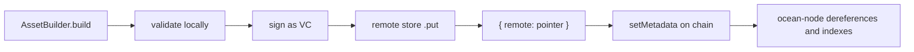

# Remote stores [Where the signed DDO actually lives]

In v1 the DDO went on chain. In v2 it does not: nautilus signs the document as a verifiable
credential, stores it somewhere off chain, and writes only a pointer —
`{ remote: <StorageObject> }` — into the NFT's metadata.

That is why publishing needs a **remote store**, and why
[`publish`](/docs/api/nautilus/publish) throws without one.



The publish path: the document is signed and stored off chain, and only its pointer is
written on chain, where ocean-node dereferences it to index the asset.

## The default: the node's own storage

`NodePersistentRemoteStore` writes to ocean-node's persistent storage, so you need no
external infrastructure at all. It takes a node client, which is why the instance is built in
two steps.

```ts twoslash
import { JsonRpcProvider, Wallet } from 'ethers'
import { Nautilus, NodePersistentRemoteStore } from '@deltadao/nautilus'

const signer = new Wallet('0x...', new JsonRpcProvider('https://rpc.dev.pontus-x.eu'))
const config = { oceanNodeUri: 'https://ocean-node.dev.pontus-x.eu' }
// ---cut---
const bootstrap = await Nautilus.create(signer, { config })

const nautilus = await Nautilus.create(signer, {
  config,
  remoteStore: new NodePersistentRemoteStore(bootstrap.getNodeClient()) // [!code focus]
})
```

It creates a bucket on demand. Pass `bucketId` to reuse one, `accessLists` to restrict who
can read it, or `label` to name it.

## IPFS

```ts twoslash
import { IpfsRemoteStore } from '@deltadao/nautilus'
// ---cut---
const store = new IpfsRemoteStore({ // [!code focus]
  uploadUrl: 'http://127.0.0.1:5001/api/v0/add' // [!code focus]
}) // [!code focus]
```

`uploadUrl` is the Kubo RPC add endpoint. Add `headers` for an authenticated gateway, and
`extractCid` if your gateway returns the CID under a key other than the usual
`Hash`/`cid`/`IpfsHash`.

:::warning
The **node** dereferences this pointer, not you. An IPFS endpoint reachable only from your
machine will publish fine and then fail to index.
:::

## What ocean-node accepts

The node's `isRemoteDDO` accepts an object with exactly one key, `remote`, and hands it to
the same storage resolver it uses for asset files. So any storage type it supports for files
works for the DDO too:

| `type` | pointer shape |
| --- | --- |
| `ipfs` | `{ type, hash }` |
| `url` | `{ type, url, method }` |
| `arweave` | `{ type, transactionId }` |
| `s3` | `{ type, s3Access }` |
| `ftp` | `{ type, url }` |
| `nodePersistentStorage` | `{ type, bucketId, fileName }` |

## Writing your own

The interface is one method.

```ts twoslash
import type { RemoteStore } from '@deltadao/nautilus'
import type { StorageObject } from '@oceanprotocol/lib'
// ---cut---
class MyStore implements RemoteStore {
  async put(payload: string, hint: { did: string }): Promise<StorageObject> { // [!code focus]
    const url = await upload(payload, `${hint.did}.json`)

    return { type: 'url', url, method: 'GET' } as StorageObject
  }
}

declare function upload(body: string, name: string): Promise<string>
```

`payload` is the signed DDO. `hint.did` is a stable name, for stores that need a key. Return
any pointer shape from the table above — nautilus wraps it with `toRemotePointer` before it
goes on chain.

## Overriding per call

The instance's store is the default; a single publish can use a different one.

```ts twoslash
import { Nautilus, IpfsRemoteStore } from '@deltadao/nautilus'
import { Wallet } from 'ethers'
import type { NautilusAsset } from '@deltadao/nautilus'

const nautilus = await Nautilus.create(new Wallet('0x1234'))
declare const asset: NautilusAsset
// ---cut---
await nautilus.publish(asset, {
  remoteStore: new IpfsRemoteStore({ uploadUrl: 'http://127.0.0.1:5001/api/v0/add' }) // [!code focus]
})
```
