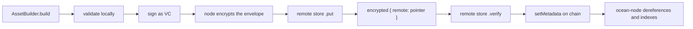

# Remote stores [Where the signed DDO actually lives]

In v1 the DDO went on chain. In v2 it does not: nautilus signs the document as a verifiable
credential, has the node encrypt it, stores the result off chain, and writes only an
encrypted pointer — `{ remote: <StorageObject> }` — into the NFT's metadata.

That is why publishing needs a **remote store**, and why
[`publish`](/docs/api/nautilus/publish) throws without one.


```mermaid
flowchart LR
  A[AssetBuilder.build] --> B[validate locally]
  B --> C[sign as VC]
  C --> D[node encrypts the envelope]
  D --> E[remote store .put]
  E --> F["encrypted { remote: pointer }"]
  F --> V[remote store .verify]
  V --> G[setMetadata on chain]
  G --> H[ocean-node dereferences and indexes]
```

The publish path: the document is signed, encrypted by the node and stored off chain, and
only its encrypted pointer is written on chain, where ocean-node dereferences it to index the
asset.

Everything is always encrypted. Neither the store nor the chain ever sees the DDO, or where
it is stored, in clear. nautilus ships two stores: `IpfsRemoteStore` (the recommended
default) and `S3RemoteStore`.

## IPFS

`IpfsRemoteStore` posts the envelope to any IPFS upload endpoint and reads the CID out of the
response. It needs no node client, so it goes straight into `Nautilus.create`.

### A Kubo node

```ts twoslash
import { JsonRpcProvider, Wallet } from 'ethers'
import { IpfsRemoteStore, Nautilus } from '@deltadao/nautilus'

const signer = new Wallet('0x...', new JsonRpcProvider('https://rpc.dev.pontus-x.eu'))
const config = { oceanNodeUri: 'https://ocean-node.dev.pontus-x.eu' }
// ---cut---
const nautilus = await Nautilus.create(signer, {
  config,
  remoteStore: new IpfsRemoteStore({ // [!code focus]
    uploadUrl: 'http://127.0.0.1:5001/api/v0/add', // [!code focus]
    probe: 'upload' // [!code focus]
  }) // [!code focus]
})
```

`uploadUrl` is the Kubo RPC add endpoint. nautilus reads every envelope back from the same
node (`/api/v0/cat`) before the metadata transaction; see
[reading it back](#reading-it-back-before-the-transaction). Add `headers` for an authenticated gateway, and
`extractCid` if your gateway returns the CID under a key other than the usual
`Hash`/`cid`/`IpfsHash`. Whatever it returns must be a CIDv0 (`Qm…`) or a base32/base36 CIDv1
(`b…`/`k…`).

`uploadUrl` (and `gatewayUrl`, `probe.url`, `unpin.url`) must be `https://`, except on `localhost`,
`127.0.0.1`, `::1` and `*.localhost` — the local Kubo node above is fine. Pass
`allowInsecureTransport: true` to accept plain `http://` elsewhere, e.g. on a private
network.

If you run Kubo yourself, apply its `server` profile (`ipfs config profile apply server`).
With the default settings it announces private and loopback addresses to the whole network.

### Pinata

Pinata works through its **file** endpoint, `pinFileToIPFS`, with a JWT as a Bearer token.
Keep the JWT in the environment, not in code:

```sh
# .env
PINATA_JWT="<your Pinata API JWT>"
```

```ts twoslash
import { IpfsRemoteStore } from '@deltadao/nautilus'

declare const process: { env: Record<string, string | undefined> }
// ---cut---
const remoteStore = new IpfsRemoteStore({
  uploadUrl: 'https://api.pinata.cloud/pinning/pinFileToIPFS', // [!code focus]
  headers: { Authorization: `Bearer ${process.env.PINATA_JWT}` }, // [!code focus]
  probe: 'upload', // [!code focus]
  gatewayUrl: 'https://gateway.pinata.cloud' // [!code focus]
})
```

The API key needs the **pin** scope (`pinFileToIPFS`) to publish, and the **unpin** scope for
[`remove()`](#cleaning-up). The CID is read from Pinata's `IpfsHash` key without any
configuration. `gatewayUrl` is how nautilus reads the envelope back before the metadata
transaction; Pinata (like any upload endpoint other than Kubo) needs it, or `verify: false`
(see [reading it back](#reading-it-back-before-the-transaction)).

:::warning[Use `pinFileToIPFS`, not `pinJSONToIPFS`]
`pinJSONToIPFS` wraps the body in its own JSON, so the stored bytes are no longer the
envelope nautilus hashed, and the node refuses to index the asset.
:::

### Cleaning up

:::danger[Keep the creation envelope of every asset that should stay indexed]
When ocean-node re-indexes (a full reindex deletes the chain's assets and replays every
event; operators run it, and it runs by itself on an upgrade that raises the node's database
version), it replays an asset from its `MetadataCreated` event,
which needs the envelope stored by **`publish()`**. If that envelope is gone, the creation
event cannot be indexed, a later `MetadataUpdated` applies only to an asset the node already
has a DDO for, and so the asset is no longer in the index, even though its current version
is still in the store.

So, for an asset that should stay indexed, keep:

- the **creation envelope**, from `publish()` (or `completePublish()`);
- the **current envelope**, from the latest `edit()`.

Envelopes of intermediate edits (superseded, neither the first nor the current one) can be
removed: on a reindex their own event fails and leaves a failure record, and the next event
brings the asset up to date. Keeping them is simplest. Safe to remove at any time: an
envelope a failed write left behind (`error.stored.cleanup === 'not-removed'`), and the
envelopes of an asset you have retired for good (REVOKED or DEPRECATED), which a reindex
then no longer restores.
:::

`IpfsRemoteStore.remove(pointer)` unpins a CID, for example the
[`PublishResponse.stored.pointer`](/docs/api/PublishResponse#stored) of an intermediate
version a later edit has superseded, or of a revoked asset. For Pinata
(`DELETE /pinning/unpin/<cid>`) and Kubo (`POST /api/v0/pin/rm?arg=<cid>`) the unpin call is
derived from `uploadUrl`; for any other service pass
`unpin: { url: 'https://…/{cid}', method }`:

```ts twoslash
import { IpfsRemoteStore, Nautilus, type NautilusAsset } from '@deltadao/nautilus'
import { Wallet } from 'ethers'

declare const process: { env: Record<string, string | undefined> }
declare const asset: NautilusAsset
// ---cut---
const remoteStore = new IpfsRemoteStore({
  uploadUrl: 'https://api.pinata.cloud/pinning/pinFileToIPFS',
  headers: { Authorization: `Bearer ${process.env.PINATA_JWT}` },
  gatewayUrl: 'https://gateway.pinata.cloud'
})
const nautilus = await Nautilus.create(new Wallet('0x1234'), { remoteStore })

const created = await nautilus.publish(asset) // keep: the creation envelope
const second = await nautilus.edit(asset) // superseded by the next edit
const third = await nautilus.edit(asset) // keep: the current envelope

await remoteStore.remove(second.stored.pointer) // [!code focus]
```

A CID that is no longer pinned counts as removed. Unpinning releases your service's copy;
IPFS has no delete, so other nodes or gateways that fetched the CID may serve it until they
garbage-collect it. The envelope is ciphertext either way.

### Checking the store before anything is spent

The DID derives from the NFT address, so the DDO can only be stored **after** the NFT is
minted. A store that fails only then would leave an NFT without metadata behind. So
`publish()`, `completePublish()` and `edit()` call the store's optional `check()` before their
first transaction.

`IpfsRemoteStore` first makes sure it will be able to [read the envelope
back](#reading-it-back-before-the-transaction) (a `gatewayUrl`, a Kubo `uploadUrl`, or
`verify: false`), and then runs whatever `probe` you configured:

| `probe` | What `check()` does |
| --- | --- |
| `'upload'` | Uploads a fixed probe of a few bytes (always the same CID). The only check that catches a pinning-service key without upload scope — Pinata reports a missing scope only on a real upload. |
| `{ url, method?, headers? }` | A test call, e.g. Pinata's `https://api.pinata.cloud/data/testAuthentication`. Must answer 2xx. Sends `headers` when given, otherwise the upload `headers` — but only to a `url` on the same origin as `uploadUrl`. |
| omitted | No check. |

If something still fails after the mint, `publish()` throws a `PublishIncompleteError`, and
[`completePublish`](/docs/api/nautilus/completePublish) finishes the publish on the NFT that
already exists. What happens to an envelope that was already stored is described in
[when a write fails](#when-a-write-fails-after-the-envelope-is-stored).

### Reading it back before the transaction

After `put()` and right before the metadata transaction, nautilus calls the store's optional
`verify()`: it reads the stored envelope back the way the node will and checks the hash, so
a store that changed the bytes, or a pointer the node cannot read, fails here, before
anything is on chain.

`IpfsRemoteStore` reads the CID back:

| Configuration | How |
| --- | --- |
| `gatewayUrl` | `GET <gatewayUrl>/ipfs/<cid>`, as the node does. Ideally the node's own `IPFS_GATEWAY`: then it also proves the node can fetch it. |
| a Kubo `uploadUrl` (`…/api/v0/add`) without `gatewayUrl` | `POST /api/v0/cat?arg=<cid>` on the same node, with the upload `headers`. It proves the node you uploaded to holds the exact bytes, not that the ocean-node's gateway reaches them. |
| any other `uploadUrl` (Pinata, your own uploader) without `gatewayUrl` | None: `check()` throws before anything is minted. Set `gatewayUrl`, or opt out with `verify: false`. |
| `verify: false` | None, by your choice. Nothing checks the stored bytes before the metadata transaction. |

With a gateway:

```ts twoslash
import { IpfsRemoteStore } from '@deltadao/nautilus'

declare const process: { env: Record<string, string | undefined> }
// ---cut---
const remoteStore = new IpfsRemoteStore({
  uploadUrl: 'https://api.pinata.cloud/pinning/pinFileToIPFS',
  headers: { Authorization: `Bearer ${process.env.PINATA_JWT}` },
  probe: 'upload',
  gatewayUrl: 'https://gateway.pinata.cloud' // fetches <gatewayUrl>/ipfs/<cid> // [!code focus]
})
```

Without one, publishing unverified is an explicit choice:

```ts twoslash
import { IpfsRemoteStore } from '@deltadao/nautilus'

declare const process: { env: Record<string, string | undefined> }
// ---cut---
const remoteStore = new IpfsRemoteStore({
  uploadUrl: 'https://uploader.example.com/files',
  headers: { Authorization: `Bearer ${process.env.UPLOADER_TOKEN}` },
  probe: 'upload',
  verify: false // nothing reads the envelope back before the metadata transaction // [!code focus]
})
```

`S3RemoteStore` always verifies, with the read key.

:::warning[The node fetches the DDO, not you]
ocean-node dereferences the pointer through **its own** IPFS gateway (`IPFS_GATEWAY`), with a
30-second timeout. An upload endpoint whose content is not reachable from that gateway will
publish fine and then fail to index. Public gateways such as `ipfs.io` and `dweb.link`
increasingly refuse server-side fetches, so a node configured with one of them may not be
able to fetch IPFS DDOs at all. When indexing fails, the node's
[indexing state](/docs/guides/ocean-node#indexing-state) says why.
:::

## S3

`S3RemoteStore` writes the envelope to an S3 bucket — AWS S3, Exoscale SOS, MinIO or any other
S3-compatible store — and the node reads it back with the AWS SDK. Like IPFS, it needs no
node client.

ocean-node has no anonymous S3 read: the pointer always carries a key pair, and that pointer
is written on chain. So the store works with **two keys**.

### Setup checklist

1. **A bucket**, private, with a prefix for DDOs, e.g. `ddo/`.
2. **A write key** for the publisher, allowed to `s3:PutObject` and `s3:DeleteObject` under
   the prefix. It never leaves your machine.
3. **A read-only key** scoped to the prefix (`s3:GetObject` only). It goes into the
   node-encrypted on-chain pointer of every asset, **forever**.
4. **`check()`** probes both before anything is minted: it uploads a probe under a random key
   with the write key, reads it back with the read key, makes sure the read key can neither
   write nor delete (unless both are the same key) — only an explicit `403 AccessDenied`
   counts as "cannot" — and deletes the probes. `verify()` reads every stored envelope back
   with the read key before the metadata transaction.
5. **Endpoints.** `endpoint` is where you upload, and must be `https://` unless it is a
   loopback host or you pass `allowInsecureTransport: true`. `nodeEndpoint` is what the node
   is told, when it reaches the bucket differently (`127.0.0.1:9000` for you, `minio:9000`
   inside Docker); it defaults to `endpoint` and may be `http://`, since only the node
   connects to it.
6. **Addressing.** `forcePathStyle: true` for MinIO and other path-style stores; the default
   is virtual-host style (`bucket.endpoint/key`). On an IP address or `localhost` endpoint
   virtual-host style cannot work, so the constructor throws until you set `forcePathStyle`
   (or `nodeForcePathStyle` for `nodeEndpoint`).
7. **Keys.** `prefix` must not contain empty, `.` or `..` segments, a leading `/` or a
   backslash.
8. **Region.** Defaults to `us-east-1`, as on the node. On Exoscale, it is the zone.

### Exoscale SOS

```ts twoslash
import { JsonRpcProvider, Wallet } from 'ethers'
import { Nautilus, S3RemoteStore } from '@deltadao/nautilus'

declare const process: { env: Record<string, string | undefined> }
const signer = new Wallet('0x...', new JsonRpcProvider('https://rpc.dev.pontus-x.eu'))
const config = { oceanNodeUri: 'https://ocean-node.dev.pontus-x.eu' }
// ---cut---
const nautilus = await Nautilus.create(signer, {
  config,
  remoteStore: new S3RemoteStore({ // [!code focus]
    endpoint: 'https://sos-de-fra-1.exo.io', // https://sos-<zone>.exo.io // [!code focus]
    region: 'de-fra-1', // the zone // [!code focus]
    bucket: 'my-ddos', // [!code focus]
    prefix: 'ddo/', // [!code focus]
    writeCredentials: { // [!code focus]
      accessKeyId: process.env.S3_WRITE_KEY!, // [!code focus]
      secretAccessKey: process.env.S3_WRITE_SECRET! // [!code focus]
    }, // [!code focus]
    readCredentials: { // [!code focus]
      accessKeyId: process.env.S3_READ_KEY!, // [!code focus]
      secretAccessKey: process.env.S3_READ_SECRET! // [!code focus]
    } // [!code focus]
  }) // [!code focus]
})
```

Both addressing styles work on SOS.

### MinIO

```ts twoslash
import { S3RemoteStore } from '@deltadao/nautilus'

declare const process: { env: Record<string, string | undefined> }
// ---cut---
const remoteStore = new S3RemoteStore({
  endpoint: 'http://127.0.0.1:9000', // [!code focus]
  nodeEndpoint: 'http://minio:9000', // [!code focus]
  forcePathStyle: true, // [!code focus]
  bucket: 'ddos',
  prefix: 'ddo/',
  writeCredentials: {
    accessKeyId: process.env.S3_WRITE_KEY!,
    secretAccessKey: process.env.S3_WRITE_SECRET!
  },
  readCredentials: {
    accessKeyId: process.env.S3_READ_KEY!,
    secretAccessKey: process.env.S3_READ_SECRET!
  }
})
```

:::danger[Three things that cannot be undone]
- **Never put the write key in the pointer.** The constructor refuses identical read and
  write keys unless you pass `allowSharedCredentials: true` (and then warns once), and
  `check()` fails when the read key can write or delete unless you pass
  `allowWritableReadKey: true`.
- **Rotating or deleting the read key breaks re-indexing** of every asset that points at it.
  The pointer on chain cannot be changed after the fact; only an edit writes a new one.
- **Whoever holds the node's key can read the read key.** It is node-encrypted, not secret
  from the node.
:::

Objects are stored as `<prefix><DID hash>/<envelope sha256>.json` (`prefix` is prepended as
is, so give it its trailing `/`), and an edit writes a new object next to the old one, so the
live version never changes under its pointer. Clean up with `remove()`, using the write key,
but keep the creation and the current envelope of every asset that should stay indexed (see
[cleaning up](#cleaning-up)). It takes the redacted pointer from `PublishResponse.stored` as
is, and only deletes objects under `prefix` in the configured bucket:

```ts twoslash
import { Nautilus, S3RemoteStore, type NautilusAsset } from '@deltadao/nautilus'
import { Wallet } from 'ethers'
declare const remoteStore: S3RemoteStore
const nautilus = await Nautilus.create(new Wallet('0x1234'), { remoteStore })
declare const asset: NautilusAsset
// ---cut---
const { stored } = await nautilus.publish(asset)

// later, once the asset is revoked for good: a live asset needs this creation envelope
await remoteStore.remove(stored.pointer) // [!code focus]
```

See [`S3RemoteStore`](/docs/api/remote/S3RemoteStore) for every option.

## When a write fails after the envelope is stored

`publish()`, `completePublish()` and `edit()` store the envelope before the metadata
transaction, so a failure in between leaves an object in the store. What nautilus does with it
depends on whether that transaction may exist:

| The failure | The transaction | The stored object | `error.stored.cleanup` |
| --- | --- | --- | --- |
| encrypting the pointer, `verify()`, building the transaction (permission, gas estimate) | never sent | removed with the store's `remove()` | `'removed'` |
| the same, but the store has no `remove()` or it failed | never sent | left; nothing points at it | `'not-removed'`, with `removeError` |
| sent, then no receipt (rejected, reverted, timed out — ocean.js does not say which) | may be mined | **kept**: it may be what the NFT now points at | `'kept'` |
| after the receipt (`waitForIndexer`, `MetadataConflictError`) | mined | kept, it is the live version | — (the error carries `published`) |

`error.stored` also carries the redacted `pointer` and the `metadataHash`, and the error
message says what happened. A `PublishIncompleteError` copies it to its own `stored`; with
`'kept'` its message no longer claims the NFT has no metadata, because the transaction may
still land. Wait until it is mined or dropped before calling `completePublish()`, which
refuses an NFT that already has metadata.

```ts twoslash
import { Nautilus, PublishIncompleteError, type NautilusAsset } from '@deltadao/nautilus'
import { Wallet } from 'ethers'
const nautilus = await Nautilus.create(new Wallet('0x1234'))
declare const asset: NautilusAsset
// ---cut---
try {
  await nautilus.publish(asset)
} catch (error) {
  if (error instanceof PublishIncompleteError && error.stored?.cleanup === 'not-removed') // [!code focus]
    console.warn('unused envelope left in the store:', error.stored.pointer) // [!code focus]
  throw error
}
```

An object that `put()` itself failed to confirm (a timeout on the upload) has no pointer, so
nautilus cannot know about it; for S3 such objects sit under `<prefix><DID hash>/`.

## Browser use (CORS)

Both stores talk to their service with plain `fetch`, so they run in a browser — but only if
the service answers CORS for your app's origin. Without it the browser blocks the request and
`check()`, `put()` or `verify()` fails with a network error.

:::danger[Credentials in a browser are public]
Whatever a browser app holds, every visitor can read. An S3 **write** key or a pinning-service
JWT in a public web app hands everyone write access to your store. Ship one only in an app
whose users bring their own credentials, or keep uploads behind your own backend (a custom
[`RemoteStore`](#writing-your-own) whose `put()` calls it). The S3 **read** key ends up in the
node-encrypted pointer anyway, but it must not be in your bundle either.
:::

### S3 buckets

`S3RemoteStore` sends signed requests with the `authorization`, `content-type`,
`x-amz-content-sha256` and `x-amz-date` headers, which makes the browser send a preflight. The
bucket must allow:

| | |
| --- | --- |
| Origins | your app's origin, e.g. `https://app.example.com` |
| Methods | `PUT` (upload, `check()`), `GET` (`verify()`, `check()`), `DELETE` (`remove()`, `check()`) |
| Headers | `authorization`, `content-type`, `x-amz-content-sha256`, `x-amz-date` |

nautilus reads only the status and the body, so no response headers need exposing. The `host`
header is part of the signature; browsers set it themselves, to the same value, so it still
matches.

On **AWS S3**, and on S3-compatible stores that implement the bucket CORS API such as
**Exoscale SOS**, save the rules as `cors.json`:

```json
{
  "CORSRules": [
    {
      "AllowedOrigins": ["https://app.example.com"],
      "AllowedMethods": ["GET", "PUT", "DELETE"],
      "AllowedHeaders": ["authorization", "content-type", "x-amz-content-sha256", "x-amz-date"],
      "MaxAgeSeconds": 3600
    }
  ]
}
```

and apply them with the AWS CLI (for SOS, add `--endpoint-url https://sos-<zone>.exo.io`):

```sh
aws s3api put-bucket-cors --bucket my-ddos --cors-configuration file://cors.json
```

**MinIO** handles CORS for the whole server rather than per bucket. It allows every origin by
default; to restrict it to your app, set the allowed origins (comma separated) on the server:

```sh
# docker / environment
MINIO_API_CORS_ALLOW_ORIGIN="https://app.example.com,http://localhost:5173"

# or at runtime, with mc
mc admin config set myminio api cors_allow_origin="https://app.example.com"
mc admin service restart myminio
```

The CORS rules apply to `endpoint`, which the browser uploads to. `nodeEndpoint` needs none:
only the node reads from it, server to server.

### IPFS

- **Kubo** does not answer CORS on its RPC API by default. Allow your origin and `POST` (every
  Kubo RPC call is a `POST`, `add` and `pin/rm` included), then restart the daemon:

  ```sh
  ipfs config --json API.HTTPHeaders.Access-Control-Allow-Origin '["https://app.example.com"]'
  ipfs config --json API.HTTPHeaders.Access-Control-Allow-Methods '["POST"]'
  ```

  The RPC API is an admin interface: never expose it to the internet, browser app or not.
- **Pinning services** decide CORS themselves; check that yours allows browser uploads and
  `DELETE` for unpinning, and read the warning above before putting its key in a web app.
- **The gateway** for `gatewayUrl` (`verify()`) must allow `GET` from your origin. Public
  gateways usually send `Access-Control-Allow-Origin: *`; a private one may need configuring.
  Without `gatewayUrl`, a Kubo store's `verify()` calls `/api/v0/cat` on the RPC API, which the
  Kubo CORS settings above cover.

Apart from the stores, the publish path itself still needs Node's `crypto` and `Buffer`
(envelope hashing and signing), as before, so a bundler must provide them for browser
publishing.

## Not for DDOs: the node's own storage

`NodePersistentRemoteStore` writes to ocean-node's persistent storage (buckets). It **cannot
hold DDOs** on ocean-node 4.2: the node resolves a remote DDO without a consumer address, and
a bucket refuses that read, so the asset would go on chain and never be indexed (see
[how the node resolves your DDO](#how-the-node-resolves-your-ddo)).
`publish()`, `completePublish()` and `edit()` therefore reject it, before any transaction,
with an error that points to `IpfsRemoteStore`.

The class still works as a plain bucket uploader — see
[buckets](/docs/guides/ocean-node#buckets) — and buckets still work for an asset's **files**
(`nodePersistentStorage` in [`addFile`](/docs/api/servicebuilder/addFile)).

## How the node resolves your DDO

This is what ocean-node 4.2 does with a nautilus publish or edit, condensed from the indexer
code. nautilus produces exactly this format; you only need it to debug an asset that does
not show up, or to write your own store.

### What is stored

The store never receives the DDO, or even the signed credential, in clear. It receives a
small JSON **envelope** whose only field is node ciphertext:

```json
{"encryptedData":"0x04a1…"}
```

That ciphertext decrypts to `{"encryptedData":"0x…"}` again, whose value is the hex of the
JSON-quoted compact JWS that signs the DDO. In pseudocode:

```ts
jws          = signer.sign(ddo)                                    // compact JWS
inner        = hexlify(utf8(JSON.stringify(jws)))                  // hex of the JSON-quoted JWS
envelope     = JSON.stringify({ encryptedData: node.encrypt({ encryptedData: inner }) })
metaDataHash = '0x' + sha256(envelope)                             // lowercase hex
pointer      = remoteStore.put(envelope, { did })                  // e.g. { type: 'ipfs', hash }
on chain     : setMetaData(state, nodeUri, '', 0x02, node.encrypt({ remote: pointer }), metaDataHash)
```

This is the same format the enterprise market produces with `encryptAsset: true`.

:::warning[Encrypted is the indexer's format, not access control]
The node encryption keeps the DDO and its location out of the store and off the chain in
clear. It does not stop someone from reading it: unless the operator sets
`AUTHORIZED_DECRYPTERS`, an ocean-node 4.2 decrypts for any caller, and its decrypt handler
does not tie the ciphertext to the asset it checks the lifecycle state of. So:

- **Revoking does not make a DDO unreadable.** The indexed copy becomes a stub, but the stored
  envelope can still be decrypted as long as it exists.
- **Every superseded version stays readable** the same way, since an edit stores a new
  envelope and leaves the old one.

To retire a version for good, remove it from the store: `remove(stored.pointer)` with the
pointer from that publish or edit (or unpin the CID). For an asset that stays indexed, that
can only be an intermediate version: the creation and the current envelope must stay, or a
reindex drops the asset (see [cleaning up](#cleaning-up)). Node operators who need
confidentiality should set `AUTHORIZED_DECRYPTERS`.
:::

### What the node checks

When the indexer sees a `MetadataCreated` or `MetadataUpdated` event:

1. **Lifecycle state.** If the NFT is DEPRECATED (2) or REVOKED_BY_PUBLISHER (3), the node
   replaces the stored DDO with a stub and stops. This is one-way — see
   [lifecycle states](/docs/api/nautilus/setAssetLifecycleState#states).
2. **Pointer.** Flags must be `0x02`. The node asks the node named in the event (`nodeUri`)
   to decrypt the pointer, and the plaintext must be `{ "remote": <StorageObject> }` with
   exactly one key.
3. **Fetch.** It resolves the pointer through its storage layer — **without a consumer
   address** — and reads the raw stored bytes.
4. **Hash.** It parses them as JSON and compares `0x` + sha256(`JSON.stringify` of that
   object) with the on-chain `metaDataHash`. A body that is not JSON fails here.
5. **Envelope.** It decrypts `encryptedData`, decodes the hex, and expects a compact JWS.
6. **DID.** The JWS payload's `id` must equal `did:ope:` + sha256(checksummed NFT address +
   chain id), and its `version` must be `5.0.0`. The signature is stored, not verified.
7. **Update rules.** Only the first metadata event of an asset in a block is processed; a
   second one in the **same block** is ignored.
8. **Database write.** The DDO is validated against the DDO v5 SHACL schema.

Because the envelope has a single string-valued key, parsing and re-serializing it gives the
same bytes back, so the hash still holds if a store or gateway adds whitespace.

### Three rules that follow

- **Same node.** The pointer and the envelope are encrypted with keys that exist only on the
  node that encrypted them, and the indexer asks the node written on chain (`nodeUri`) to
  decrypt. nautilus writes the `oceanNodeUri` it encrypted with. If that node is gone, or
  restricts who may decrypt (`authorizedDecryptersList`), other nodes cannot index the asset.
- **One metadata event per asset per block.** A `Nautilus` instance runs its own writes to
  one NFT one after the other, so they cannot collide. A write from another instance or
  process can, and nautilus then throws a `MetadataConflictError` after the receipt — see
  [editing](/docs/guides/edit#one-metadata-event-per-block).
- **Errors are not on chain.** Both transactions succeed even when indexing fails. The node
  records the outcome in its indexing state, `GET <node>/api/aquarius/state/ddo`, which
  nautilus reads for you: [`waitForIndexer`](/docs/api/nautilus/waitForIndexer) throws an
  `IndexingError` with the node's message, and
  [`getIndexingState`](/docs/guides/ocean-node#indexing-state) returns the raw record. A
  failure is filed under the old `did:op:` id with the `nft` and `txId` — query `?txId=` —
  and stays after a later success; a success is filed under the `did:ope:` DID — query
  `?did=`.

[`PublishResponse.stored`](/docs/api/PublishResponse#stored) returns the pointer (redacted:
secrets read `'<redacted>'`) and the hash, so you can verify what was stored, or unpin it
later. In a `url` pointer that means the user name and password, every query value (the
parameter names stay) and the fragment; scheme, host and path stay.

## Storage options

The pointer is any ocean-node file object, so the envelope can live anywhere the node can read
a file from **without a consumer address**. nautilus ships `IpfsRemoteStore` and
`S3RemoteStore`; for the others, [write your own store](#writing-your-own) that returns the
pointer type.

| `type` | Pointer | Works on 4.2 | Node needs | Caveats |
| --- | --- | --- | --- | --- |
| `ipfs` | `{ type, hash }` | **Yes** — the recommended default (`IpfsRemoteStore`) | `IPFS_GATEWAY` | The CID is public, but the content is ciphertext. Unpin to clean up. The gateway must be able to fetch the content (30 s timeout). |
| `url` | `{ type, url, method: 'GET', headers? }` | Yes | URL must not match `UNSAFE_URLS` | Any HTTPS host, e.g. a public-read object in a bucket. Headers end up inside the encrypted pointer. Do not use expiring pre-signed URLs: re-indexing would fail once they expire. |
| `s3` | `{ type, s3Access: { endpoint, bucket, objectKey, accessKeyId, secretAccessKey, region?, forcePathStyle? } }` | **Yes** — supported natively (`S3RemoteStore`) | — | Works with S3-compatible stores (`forcePathStyle: true` for MinIO and other path-style stores). There is no anonymous read: the pointer always carries a key pair, so **the credentials end up inside the on-chain pointer** — node-encrypted, but readable by whoever holds the node key, and permanent. Upload with a separate write key, and put a read-only key scoped to the DDO prefix in the pointer. Rotating that key breaks re-indexing of older assets. See [S3](#s3). |
| `arweave` | `{ type, transactionId }` | Yes | `ARWEAVE_GATEWAY` | Permanent: it can never be cleaned up. Not for test data. |
| `ftp` | `{ type, url }` | Technically | — | Credentials in the URL. Not recommended. |
| `nodePersistentStorage` | `{ type, bucketId, fileName }` | **No** | — | Buckets require a consumer address, and the node does not pass one when it resolves a DDO. nautilus rejects this pointer. |

## Writing your own

The interface is one required method, `put`, and three optional ones: `check`, `verify`, and
`remove` for cleanup (nautilus calls `remove` only for an envelope whose metadata transaction
was never sent; see [when a write fails](#when-a-write-fails-after-the-envelope-is-stored)).

```ts twoslash
import type { RemoteStore } from '@deltadao/nautilus'
import type { StorageObject } from '@oceanprotocol/lib'
// ---cut---
class MyStore implements RemoteStore {
  async put(payload: string, hint: { did: string }): Promise<StorageObject> { // [!code focus]
    // Store `payload` byte for byte: its sha256 is the on-chain metadata hash.
    const url = await upload(payload, `${hint.did}.json`)

    return { type: 'url', url, method: 'GET' } as StorageObject
  }

  async check(): Promise<void> { // [!code focus]
    // Throw here if put() is going to fail: bad credentials, an unreachable endpoint.
    await ping()
  }

  async verify(pointer: StorageObject, expectedHash: string): Promise<void> { // [!code focus]
    // Read it back as the node will, and hash it as the node does.
    const body = await download(pointer)
    const actual = await sha256Hex(JSON.stringify(JSON.parse(body)))
    if (`0x${actual}` !== expectedHash) throw new Error('the store changed the envelope')
  }
}

declare function upload(body: string, name: string): Promise<string>
declare function download(pointer: StorageObject): Promise<string>
declare function sha256Hex(text: string): Promise<string>
declare function ping(): Promise<void>
```

The contract:

- **`put()` receives the envelope**, a JSON string `{"encryptedData":"0x…"}` — not the signed
  DDO.
- **Store it unchanged** and serve it back as is. The node hashes what it fetches (after a
  `JSON.parse`/`JSON.stringify` round trip, so whitespace does not matter) and compares it
  with the on-chain hash, so wrapping it, re-encoding it or adding fields breaks indexing.
- **Return a pointer of a supported type** — `ipfs`, `url`, `s3`, `arweave` or `ftp`, from the
  [table above](#storage-options) — that the **node** can fetch without a consumer address.
  Return the plain storage object, not one already wrapped in `{ remote }`. An `ipfs` pointer's
  `hash` must be a CIDv0 or CIDv1.
- **`remove()`, if you implement it, must accept the redacted pointer** from
  `PublishResponse.stored`: secrets in it read `'<redacted>'`. For a `url` pointer, work from
  the host and path: the user info, every query value and the fragment are redacted.

nautilus checks every pointer, custom stores included, before anything goes on chain. It
rejects `nodePersistentStorage`, any other unknown type (matched case-insensitively),
a pointer missing what its type's storage class needs (a `url` without an absolute http(s) `url` or a GET/POST `method`, or with non-string `headers`; an `s3` without non-empty `bucket`, `objectKey`, `endpoint`, `accessKeyId` and `secretAccessKey`; an `arweave` `transactionId` that is a URL or path; an `ftp` `url` that is not `ftp://`/`ftps://`), and a
pointer that is not a plain JSON object or is already wrapped in `{ remote }`; the rest it
wraps in `{ remote }` and has the node encrypt. On `publish()`, a rejected pointer surfaces as
a `PublishIncompleteError`, because the NFT already exists by then.

`hint.did` is a stable name, for stores that need a key.

`check()` runs before the first transaction of a `publish()`, `completePublish()` or
`edit()`. Implement it whenever your store can tell up front that it will fail. `verify()`
runs right before the metadata transaction, with the unredacted pointer `put()` returned;
implement it when you can read the object back the way the node will. Resolve only after
that read: if a configuration leaves no way to read back, throw (and say so in `check()`)
rather than resolve, unless the user opted out explicitly.

## Overriding per call

The instance's store is the default; a single publish can use a different one.

```ts twoslash
import { Nautilus, IpfsRemoteStore } from '@deltadao/nautilus'
import { Wallet } from 'ethers'
import type { NautilusAsset } from '@deltadao/nautilus'

const nautilus = await Nautilus.create(new Wallet('0x1234'))
declare const asset: NautilusAsset
// ---cut---
await nautilus.publish(asset, {
  remoteStore: new IpfsRemoteStore({ uploadUrl: 'http://127.0.0.1:5001/api/v0/add' }) // [!code focus]
})
```
