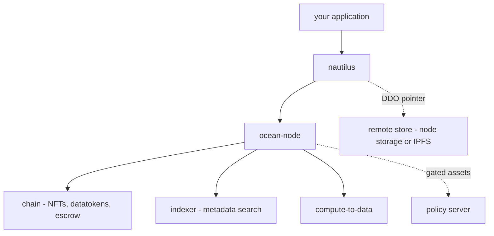

import { Card, Cards } from 'vocs'

# Why Nautilus [A brief introduction on challenges nautilus aims to solve]

:::warning
nautilus 2.0.0 is a **pre-release**. The API can still change between betas and you should
expect bugs. Install it with `npm install @deltadao/nautilus@beta`, and please report anything
you hit on [GitHub](https://github.com/deltaDAO/nautilus/issues).
:::

## Common Pain Points
As a developer working within [OceanProtocol](https://oceanprotocol.com) ecosystems, you're likely familiar with the complexities of data publishing, consumption, and computation.

From configuring metadata and defining pricing schemes to managing access controls, these tasks can often be time-consuming and error-prone, detracting from your focus on building innovative applications.

This is exactly why we built **nautilus**: a developer-focused TypeScript library designed to simplify and streamline your development experience within any OceanProtocol ecosystem.

## Features
nautilus addresses these common pain points faced by developers, offering a range of features to enhance productivity and efficiency.

### Builder Pattern
nautilus leverages a [Builder Pattern](https://en.wikipedia.org/wiki/Builder_pattern) to simplify and streamline the configuration process for data economy assets and services. By encapsulating the construction of complex metadata objects into separate builder classes, nautilus provides a clear and intuitive interface for developers to specify the desired configurations.

This approach offers several benefits to end-users, including improved readability, maintainability, and flexibility. With the Builder Pattern, developers can easily chain together method calls to set various properties of assets and services, making the configuration process more declarative and less error-prone. 

### Feature complete
Whether you want to manage data assets or their respective services, utilizing publish and edit functionalities, want to access and download data that has been published in a specific dataset or leverage OceanProtocol's Compute-to-Data capabilities: nautilus aims to enable every single step necessary in a streamlined manner.

For example, you can easily start compute jobs, monitor their progress, and retrieve results seamlessly — all from within your development environment.

### Credential-gated data

Some data cannot simply be sold to anyone — it has to go to a party who can prove something
about themselves. nautilus handles that end to end: declare which verifiable credentials an
asset requires, and on the consuming side nautilus drives the whole exchange with the policy
server and the walt.id wallet, so a gated asset is no harder to consume than an open one.

See [Credential-gated assets](/docs/guides/identity).

## What nautilus v2 sits on

nautilus v2 targets the current Ocean stack: `@oceanprotocol/lib` 9.x, ethers v6,
**ocean-node** in place of the separate Aquarius and Provider services, and **DDO v5** —
where an asset is a W3C Verifiable Credential — with types and validation from
`@oceanprotocol/ddo-js`.

One **ocean-node** now serves metadata, provider services, the indexer and compute — replacing
v1's separate Aquarius and Provider deployments.

Two consequences are worth knowing up front. Validation is now entirely local, so a malformed
asset fails before it costs any gas. And the DDO itself is signed and stored off chain, with
only a pointer written on chain, which is why publishing needs a
[remote store](/docs/api/nautilus/create#remotestore).

If you are coming from nautilus v1, the
[migration guide](/docs/migration) maps every
call.

## Where to go next

<Cards>
  <Card title="Getting Started" description="Install, create a signer, and download your first asset." to="/docs/getting-started" />
  <Card title="Migrating from v1" description="A call-by-call map of everything that changed." to="/docs/migration" />
  <Card title="Publishing" description="Put your own data on chain as a DDO v5 credential." to="/docs/guides/publish" />
  <Card title="Compute to Data" description="Run algorithms on data you never see." to="/docs/guides/compute" />
  <Card title="Credential-gated assets" description="Require verifiable credentials to consume." to="/docs/guides/identity" />
</Cards>